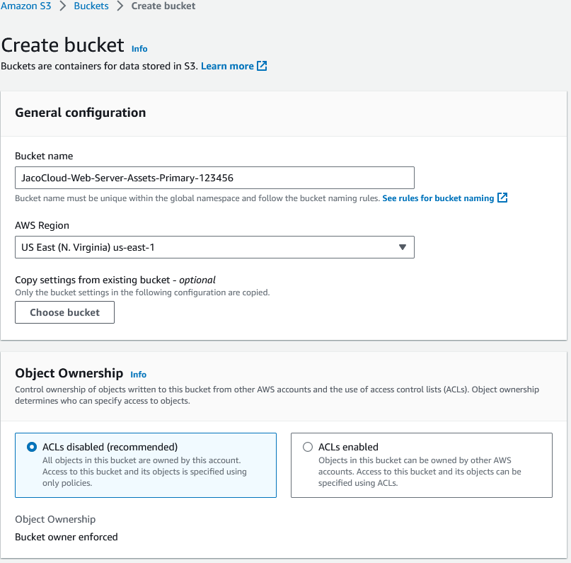
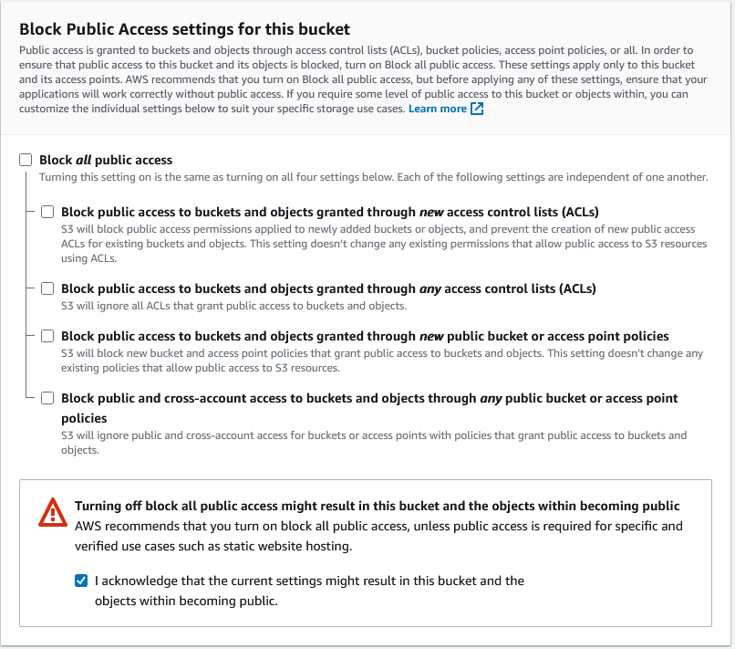
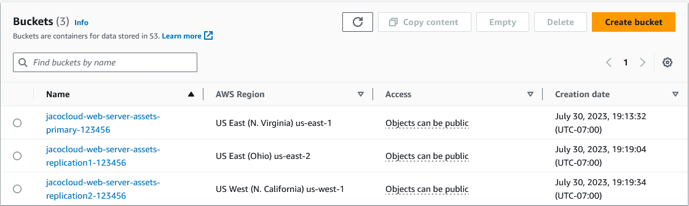
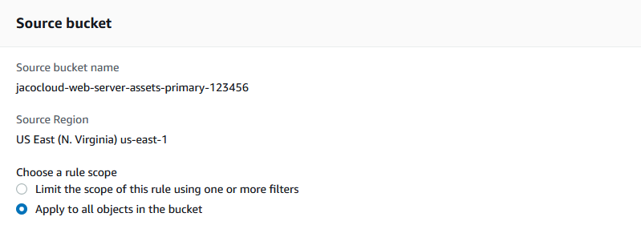
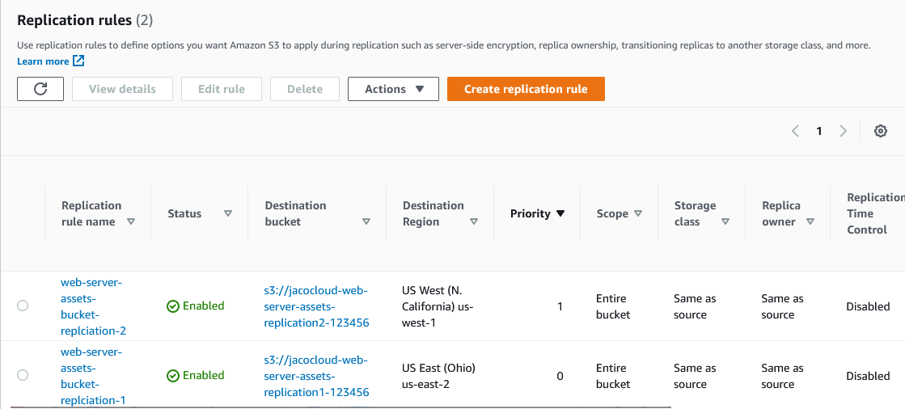
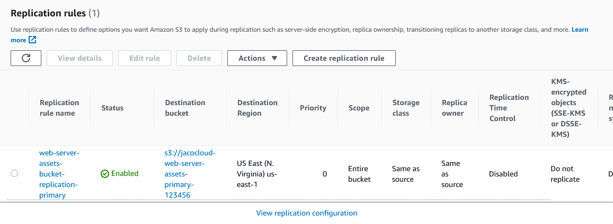
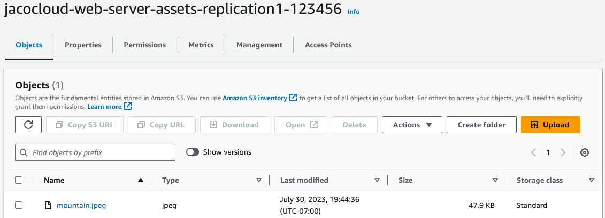
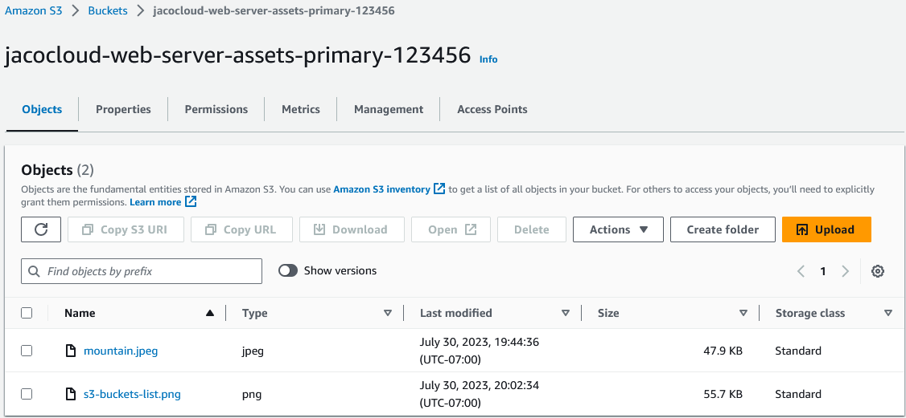

In this section, I'll create three S3 buckets in different regions, to used to host the assets used by the web server. The 3 buckets will be set up for cross-region replication to allow for fault tolerance.

# Create the primary bucket for the Web Server assets

The bucket will be created using the following settings:

**Name:** jacocloud-web-server-assets-primary-*xxxxx* (the final characters need to be unique across all of AWS)

**AWS Region:** US-East (N. Virginia)

**Block Public Access:** Disabled (since this is for a web server, we want the assets to be public)

**Bucket Versioning:** Enabled (for fault tolerance and replication)

**Tag:** AWS-Labs:Test-Web-Server (for tracking to this project)

Keep all other settings to default values

# Create the two replication buckets

Create the other two buckets with the following name format and region:

*jacocloud-web-server-assets-replication1-*xxxxx**

**Region:** US-East (Ohio)

*jacocloud-web-server-assets-replication2-*xxxxx**

**Region:** US-West (N. California)

For simiplicity, I'll chose to copy the settings from the primary bucket.

Once complete, the three buckets will be available.

# Configure cross-region replication on primary bucket

From the primary bucket, go to the Management tab and select **Create replication rule**.

Name the bucket and ensure the status is enabled.

For source bucket, change the rule scope to **Apply to all objects in the bucket**

Configure the destination bucket to the *replication1* bucket I configured

For simplicity, I'll leave the remaining settings as default.

When prompted, I'll choose not to replicate existing objects since all buckets are currently empty. Depending on the scenario though, replicating existing objects should be considered.

Once complete, repeat the steps above to replicate to the *replication2* bucket. After this is complete, two replication rules should be visible.

## Configure cross-region replication on the secondary buckets

Once the primary bucket is complete, replication rules will need to be set up on the both replication buckets to ensure objects are replicated to all 3 buckets regardless of which one data is written to. For each of these buckets, a replication rule will need to be set up back to the primary bucket to complete the replication cycle.

**Note:**s the two replication buckets should not have rules set up for each other, or else the replication process will fail.

## Test replication between buckets

From the primary bucket, upload a file

Check to make sure the file is replicated to the other buckets.

Test in reverse by uploading a file to one of the replication buckets.

Confirm file is replicated back to the other buckets.

