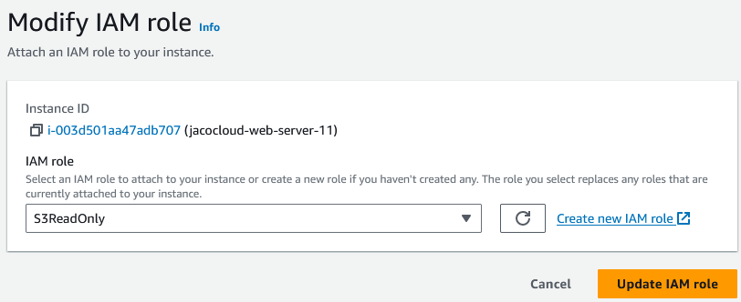

In this section, we will configure the EC2 instance housing the web server to access the S3 buckets we created to store the assets.

## Assign IAM role allowing access to S3 buckets

From the EC2 instace, selection Actions > Security and select **Modify IAM Role**

Choose an IAM role that allows read access to S3, or create one manually if a role doesn't exist.

The EC2 instance is now configured to read from S3 buckets. Any references made within the web server to an asset on one of the public S3 buckets will now be allowed.

