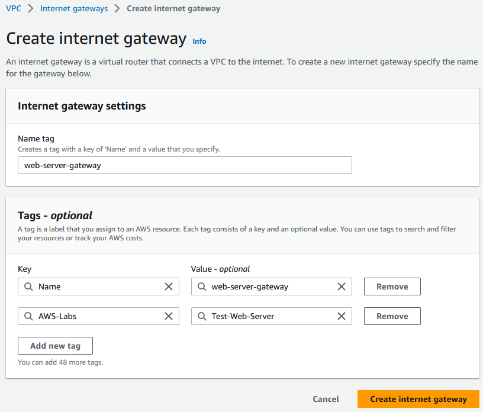
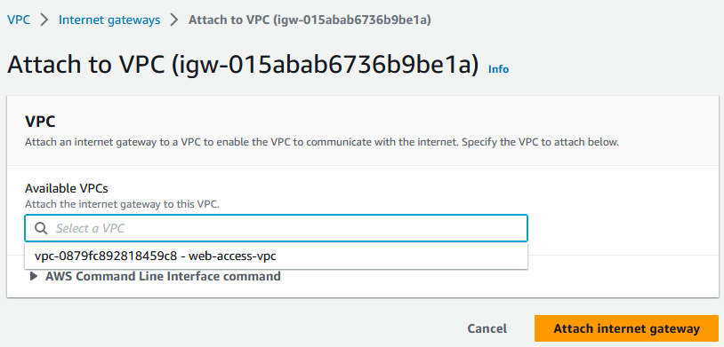

This section will be used to create a new VPC to allow Web Access. Since I am creating a simple VPC, I'll use the console for simplicity.

## Create a new VPC

1. From the VPC console, click Create VPC.
2. Select VPC only, set the name as **web-access-vpc** and define a CIDR block not currently in used in my account.

## Create a subnet for the Web server and associated assets

From the VPC console, create a Subnet in the newly created VPC.

## Create an Internet Gateway in the newly created subnet

From the VPC console, create a new Internet Gateway.

Attach the gateway to the VPC

## Allow Web Access from the VPC Route Table

From the VPC Console, edit the route table for the new VPC. Create a new route from destination 0.0.0.0/0 (general internet traffic) and select the target as Internet Gateway. Then, select the new Internet Gateway. When the gateway has been selected, save the changes.

The new VPC and subnet are now configured to allow internet access.
