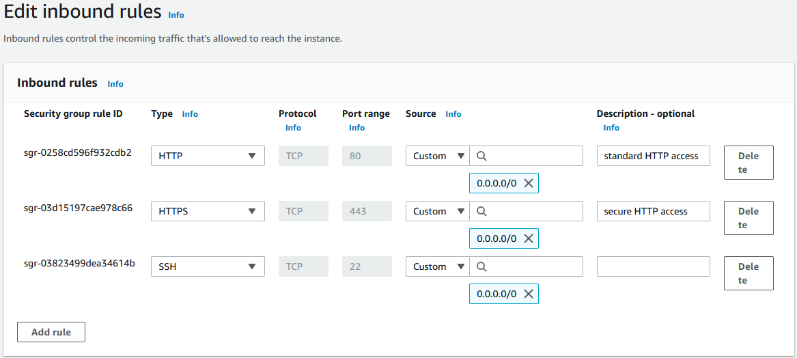
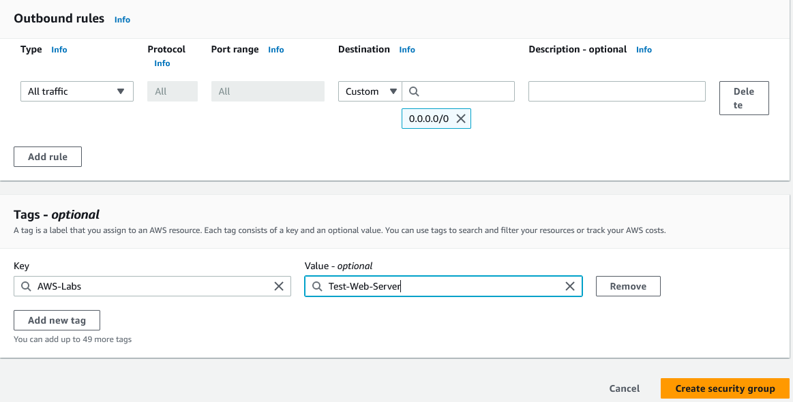

In this next section, I'll create an EC2 security group to allow web access.

## Create a new Security Group

In the EC2 console, navigate to Security Groups and select **Create security group**.

In the basic details, provide a recognizable name and description, and add it to the VPC we created earlier on the project (**web-access-vpc**)

Define the inbound rules to support standard HTTP and HTTPS, as well as SSH (for the ability to connect to the instance using Instance Connect or SSH commands)

Keep the default outbound rules and add the tag we have been using for this project.

Save the security group.