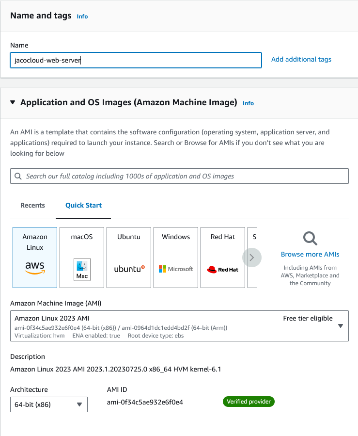
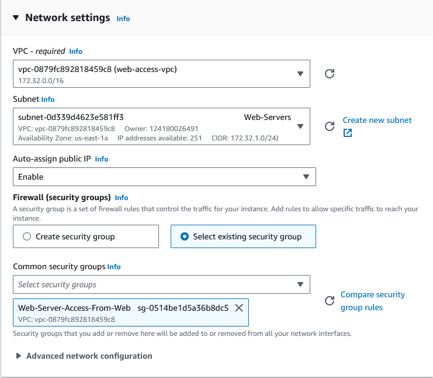

In this section, I'll be creating an EC2 instance (using T2.micro for cost considerations)

## Create an EC2 instance for the web server

From EC2 instances, select **Launch instances**.

Create a name for the web server and select Amazon Linux since we are creating a simple instance.

Create a t2.micro instance, and proceed without a key pair for this project.

**Note** In a real-world instance, I would generate a key pair and use it for secure access to the web server. I'm just proceeding without it in this project to keep the setup simple, and since all resources will be deleted once the project is complete.

Edit the Network Settings and make the following changes:

* Change the VPC from the default VPC for my account to the VPC created for this project.
* Set Auto-assign Public IP to **Enable**, as a public IP will be required for the web server to be accessible from the web.
* Choose **Select existing security group** and choose the security group created earlier in this project for Web access.

Keep the remaining settings as default and select **Launch instance**. 

## Configure Apache web server on the EC2 instance.

Once the instance is running, connect to the instance using EC2 instance connect.

**Note** in a production environment, it would be better practice to connect securely to the instance using SSH and authenticate using a key pair.

Once the instance is launched on Instance Connect, run the following commands to start the Apache web server (the application **httpd** is the Apache web server):

    sudo yum update -y
    sudo yum install httpd -y
    sudo service httpd start
    sudo chkconfig httpd on

Once these commands have run, check access to the web server by navigating to the public IP address associated to the EC2 instance.

If the web server successfully launches, it will display the default Apache web server message:

