In this section, I'll create an auto-scaling group for the EC2 instance.

# Create an Amazon Machine Image (AMI) based on the existing web server

In order to auto-scale the server, I need an AMI which will allow me to create multiple copies of the same server as it is configured.

1. From the EC2 console, select the instance for my web server. Select Actions > Images and templates > image. This image will be used in the launch template.

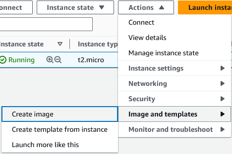

2. Create an image name, and keep the remaining settings as default.

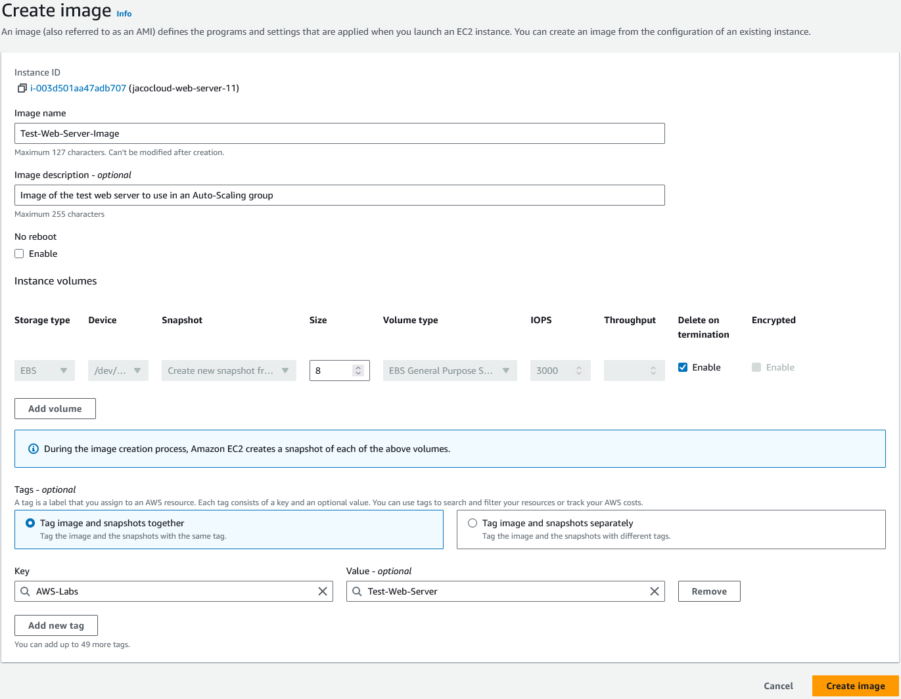

# Create a Launch Template and reference the created AMI.

A launch template will be referenced by the auto-scaling group to create new instances as needed.

1. From the EC2 console, select Launch templates and then **Create launch template**. Provide a launch template name and version number. Check the box for **Auto Scaling guidance**.

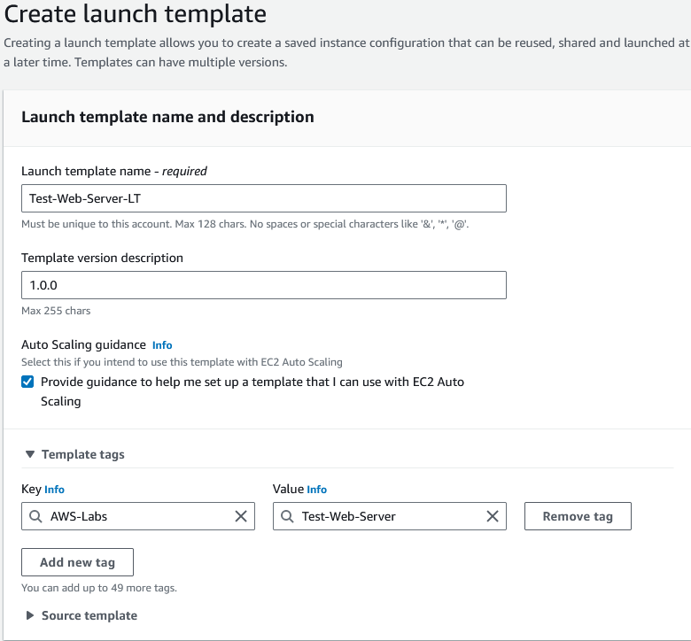

2. In Application and OS Images, select the My AMIs tab and ensure the AMI we just created is selected.

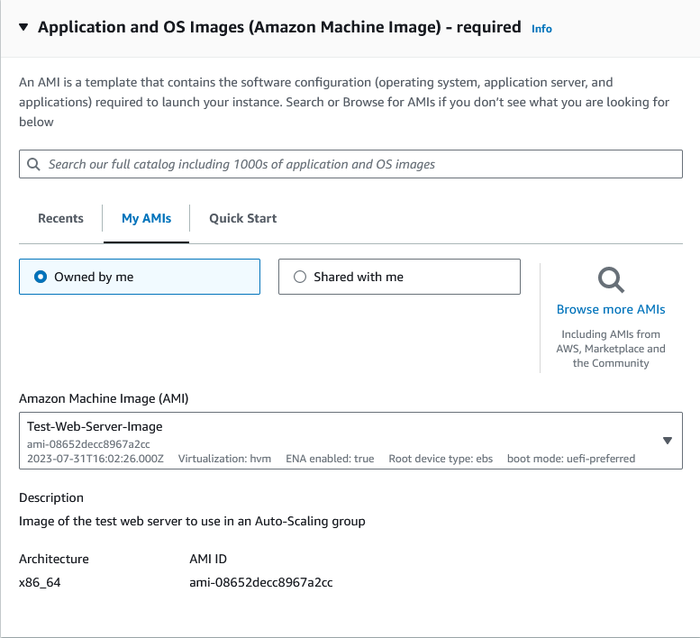

3. Update the settings for the Instance type and select the key pair as applicable.

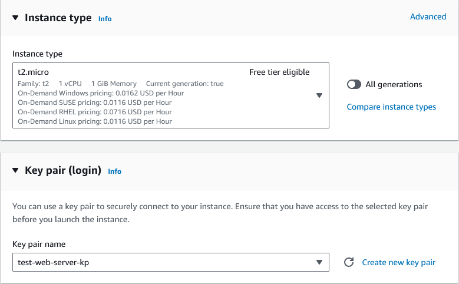

4. In the network settings, select the security group we created earlier for the web server.

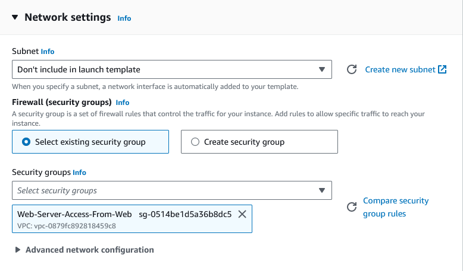

Keep the remaining settings as default and create the launch template.

# Create an Auto Scaling group and reference the created launch template

1. From the EC2 console, go to Auto Scaling groups then select **Create Auto Scaling group**. Provide a name for the Auto Scaling group and select the launch template we just created.

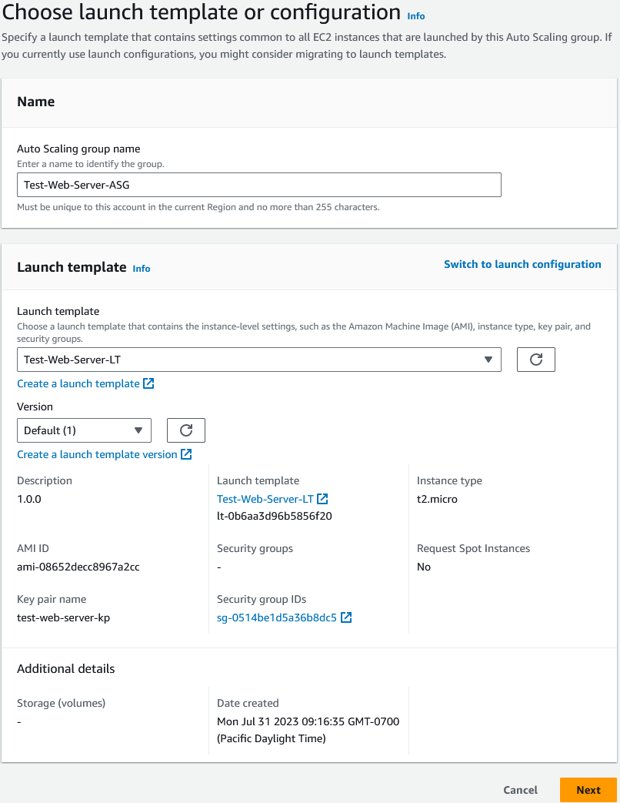

2. Select the VPC and subnets created earlier.

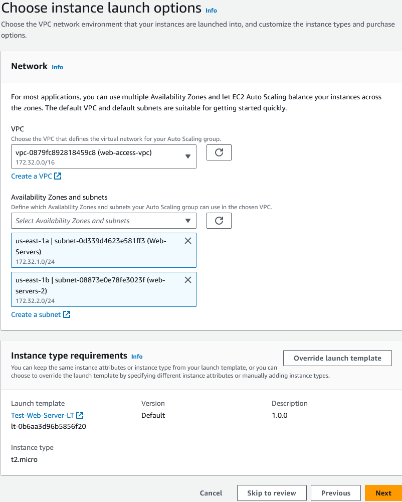

3. Keep the advanced options as default and proceed to the group size and scaling policies.

4. Set the group size settings. Since this is a basic test, I'll set the capacity levels as shown below.

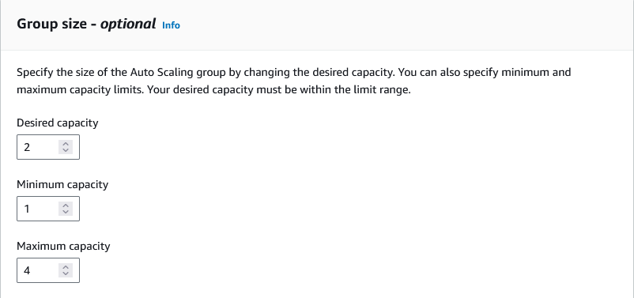

5. For this basic test, I'll target the scaling policy to trigger at 25% CPU utilization.

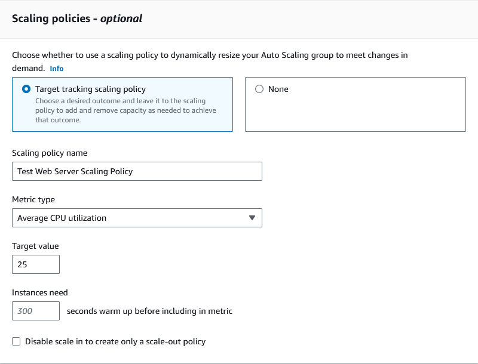

Keep the remaining settings as default and complete the ASG configuration.

**Note:** In a production environment, notifications such as SNS alarms should be configured so admins are know when scaling events have occurred.

6. Since the Auto Scaling group was configured with the desired number of instaces as 2, there will now be 2 more instances of the web server crated.

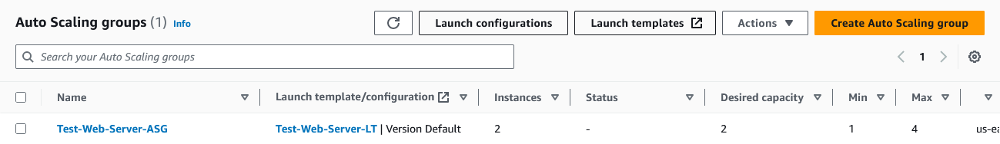

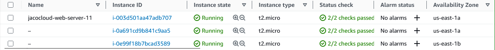

7. Since the orignal web server is not part of the Auto Scaling group, it can be added by selecing that server, and selecting Actions > Instance Settings > Attach to Auto Scaling Group.

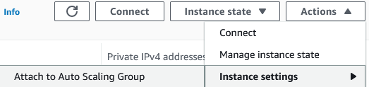

8. Choose the Auto Scaling group we created and select Attach.

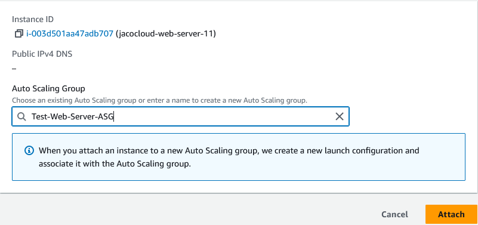

