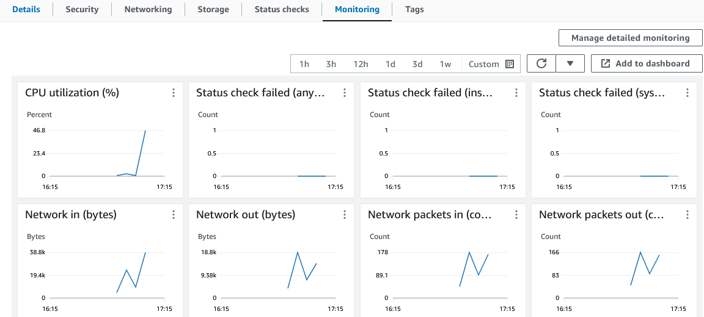
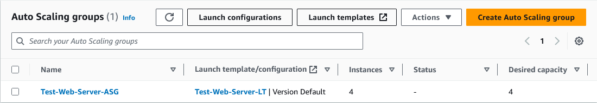
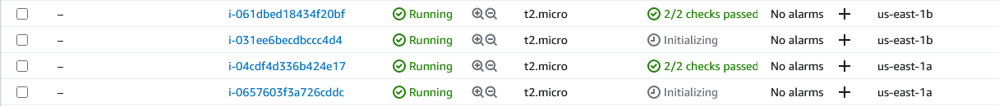

In this section, I'll set up a stress test one of the web servers in the Auto Scaling group to test the scale out functionality. I'll be using the Stress utility.

# Install the Stress utility

Connect to the instance using Amazon Instance Connect or SSH.

The following commands can be used to install Apache Bench:

    sudo yum install -y amazon-linux-extras

    sudo yum install stress -y

# Perform a stress test

The following command can be used to perform a stress test using Stress:

    stress -c 10

# Monitor CPU utilization and watch for new instances.

As the utility runs, check the progress of the CPU utilization in by looking at the instance and checking the Monitoring tab.

After it has been running for a few minutes, check the status of the Auto Scaling group and the instance list, and see that new instaces are being added.

**Note** the total number of instances will not exceed the maximum capacity defined in the auto scaling group.

# Cancel the stress test

Cancel the stress test that was started by pressing **CTRL + C** within the Instance Connect or SSH window.

After some time, the Auto Scaling group will reduce the amount of instances down to the Minimum capacity due to lack of load.

