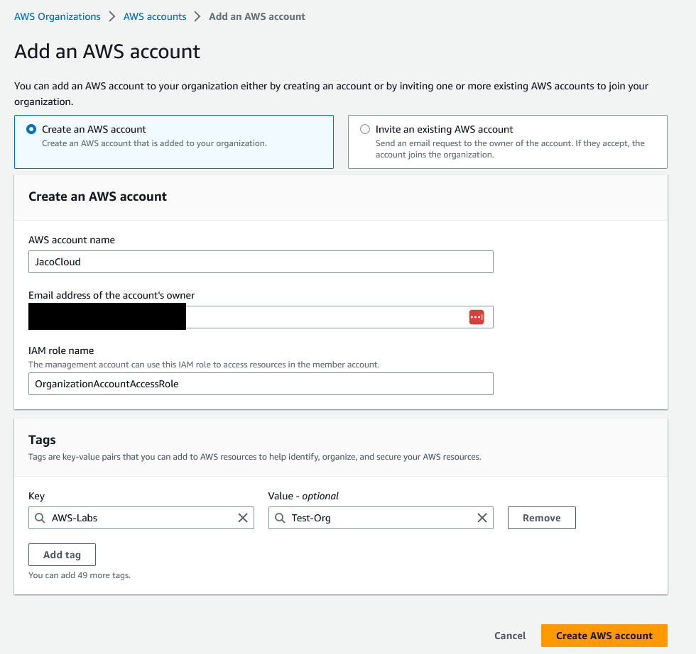
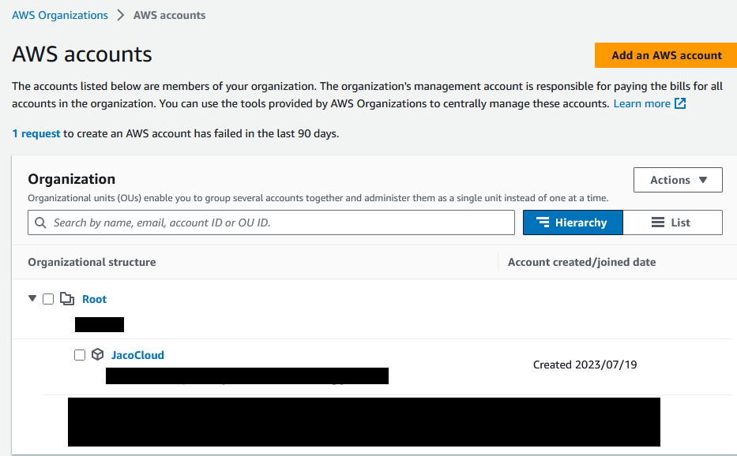

# Walkthrough

To begin the project, I'll add a new AWS account to manage organization. For this project, the new account will be named **JacoCloud**, and it will reside within my Root organization. The main purpose of this account is so that the Root user is not required for Administration.

I will also add the Tag of AWS-Labs:Test-Org

Once the account is created, it will show up in my Organization (sensitive details blocked out for privacy):

