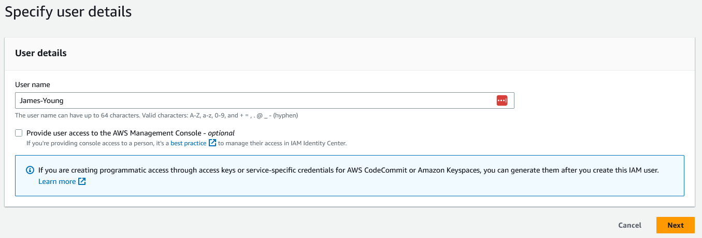
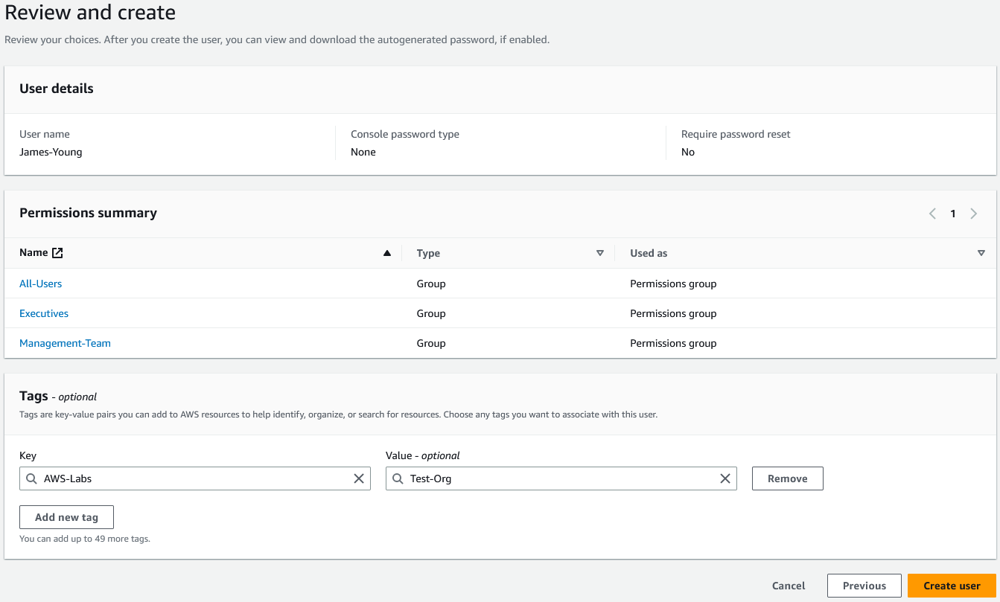
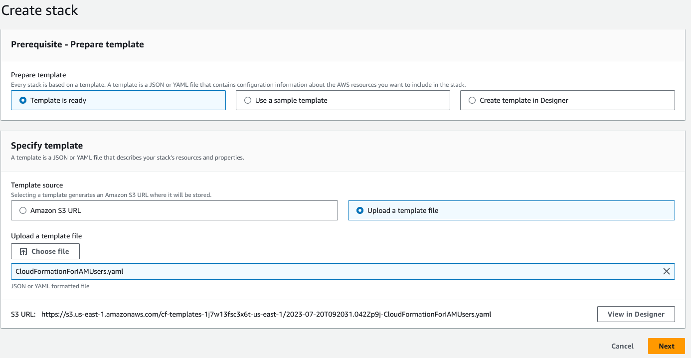
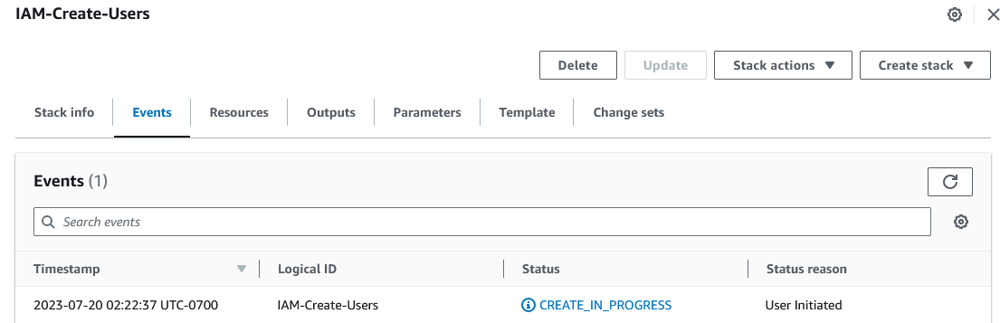
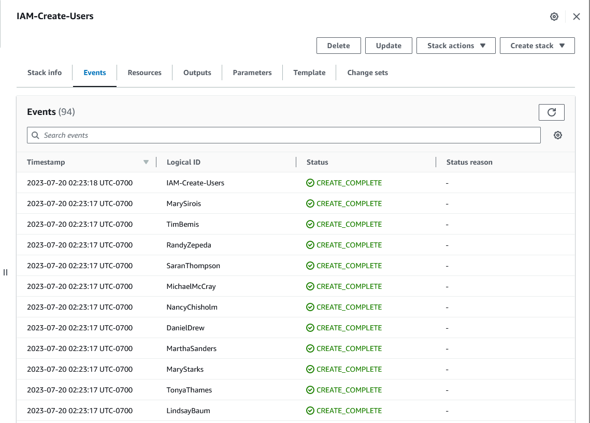
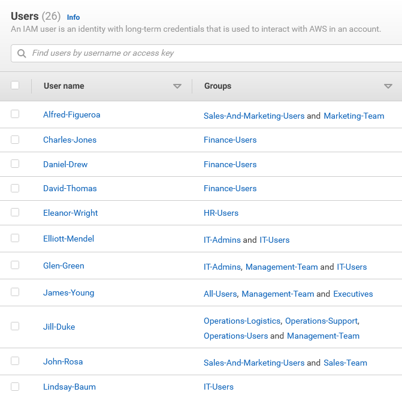

# Setup

* For simplicity, I'll be creating the groups in IAM. There are additional features in the new IAM Identity Center, mostly tied around federation.
* The list of user accounts to be added will are located [here](User-Accounts.MD)
* This assumes the appropriate groups have been created
* No permissions policies will be applied to users at this time. I will be dynamically adjusting permissions policies in groups as needed in future projects.

# Create the first user in the IAM Console

First, I'll create the **James Young (CEO)** user in the IAM console. 

**Note**: At this point I will not be adding access to the AWS Management Console for any users.

Complete the wizard and ensure the user is added to the defined groups

Once complete, confirm the user is now listed in the IAM console

# Create the next user using AWS CLI

Next, I'll create the **Glen Green (IT Manager)** user using a basic CLI commands

    $ aws iam create-user --user-name Glen-Green

If the command runs successfully, it will show output similar to below:

    {
        "User": {
            "Path": "/",
            "UserName": "Glen-Green",
            "UserId": "AIDARZ2NU2R5YYEHU3MGQ",
            "Arn": "arn:aws:iam::************:user/Glen-Green",
            "CreateDate": "2023-07-20T08:48:37+00:00"
        }
    }

Next, I'll add the user to the appropriate groups (each command needs to be run independently)

    $ aws iam add-user-to-group --group-name IT-Admins --user-name Glen-Green
    $ aws iam add-user-to-group --group-name IT-Users --user-name Glen-Green
    $ aws iam add-user-to-group --group-name Management-Team --user-name Glen-Green

If the command runs successfully, there will be no output in the CLI. Otherwise an error message will be displayed.

# Create the remaining groups using CloudFormation

Prior to creating a CloudFormation Stack, an IAM policy and role will need to be created to allow CloudFormation to List, Read and Write to IAM.

Once the Policy and Role is set up, Create the stack and upload the yaml template and then complete the wizard:

Once the stack has been created, view the progress in the CloudFormation Console

# Confirm Groups Added to IAM

Once the CloudFormation Stack has run, return to IAM and ensure the users have been created and associated to the appropriate groups.

